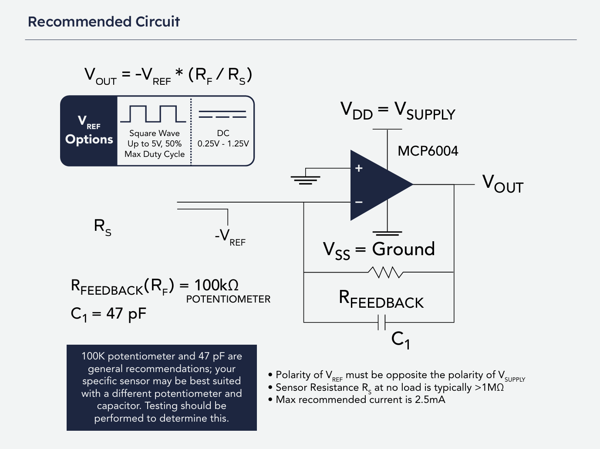
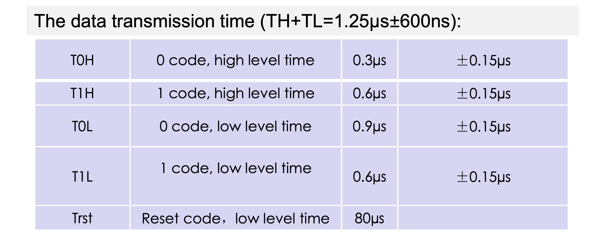
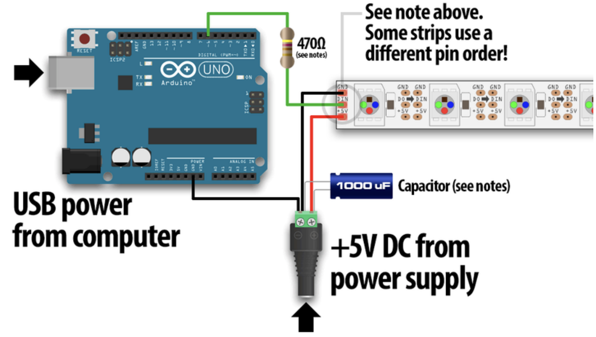

# final-project-skeleton

**Team Number: 9**

**Team Name: dAnciNG (MACHINE NOT LEARNING)**

| Team Member Name | Email Address           |
| ---------------- | ----------------------- |
| Xiang Ding       | ding1026@seas.upenn.edu |
| Yang Xing        | yangxing@seas.upenn.edu |
| Shang Wang       | wang0102@seas.upenn.edu |

**GitHub Repository URL: https://github.com/upenn-embedded/final-project-f25-f25_final_project_t09.git**

**GitHub Pages Website URL:**

## Final Project Proposal

### 1. Abstract

**This project presents a portable music game mat powered by the ATmega328PB microcontroller. The system integrates LEDs, pressure sensors, a buzzer, and an LCD to create an interactive platform where players step in rhythm with preloaded songs. Each correct step triggers full light in light strip and sound feedback, while the LCD displays real-time scores. The design combines entertainment and exercise, offering a fun way to stay active at home.**

### 2. Motivation

In modern life, people often struggle to find enjoyable ways to stay active at home. Traditional home workouts can feel repetitive and uninspiring, while portable fitness or entertainment equipment is usually bulky and inconvenient to use. Activities like yoga or simple floor exercises, though effective, often lack engagement and excitement.

Inspired by the interactive fun of arcade dance machines, we aim to design a lightweight, portable version that brings the same sense of rhythm, movement, and enjoyment into the home environment. Our goal is to make physical activity more accessible and entertaining—something that not only helps people exercise but also lets them have fun while doing it.

This project combines entertainment technology with fitness in a creative and interactive way. It challenges us to rethink how people can engage with exercise through music, rhythm, and motion tracking. By turning a familiar arcade experience into a compact home device, we explore how playful design can promote healthier lifestyles. Moreover, it provides a great opportunity to integrate hardware design, sensor systems, and human–computer interaction, making it both technically and socially meaningful.

### 3. System Block Diagram

*Show your high level design, as done in WS1 and WS2. What are the **critical components** in your system? How do they communicate (**I2C?, interrupts, ADC, etc.**)? What **power regulation** do you need?*

The **ATmega328PB** acts as the main controller that reads input signals, processes them, and generates both visual and audio feedback. The **Pressure Sensors (Force Sensors)** are connected to the microcontroller through ADC channels to detect foot pressure, and interrupts are used for quick response when a player steps on a pad. The **LEDs (Address LED Strip Serial RGB)** are driven using the SPI interface or GPIO pins depending on the LED type, allowing fast and synchronized lighting effects. The **LCD** communicates with the microcontroller through SPI to display game information such as scores and progress. The **Audio Speaker** is controlled by a PWM signal generated by one of the microcontroller timers, producing sound feedback for correct steps. An external ADC (MCP3008 over SPI or ADS1115 over I2C) can be added. All components share a common ground and operate under the same control loop.

The power system uses a regulated 5 V supply from USB with a voltage regulator. A 3.3 V LDO may be added if any module requires lower voltage. Decoupling capacitors and protection components ensure stable operation. In summary, the ATmega328PB handles sensor input via ADC and interrupts, drives LEDs and LCD via SPI or GPIO, and produces sound through PWM, all powered by a stable 5 V regulated system.

### 4. Design Sketches

*What will your project look like? Do you have any critical design features? Will you need any special manufacturing techniques to achieve your vision, like power tools, laser cutting, or 3D printing?  Submit drawings for this section.*

The finished project will look like a flat, flexible play mat with nine marked stepping zones, each backed by a pressure sensor, RGB LED strips around each zone, a small control box housing the ATmega328PB board, power module and speaker, and a compact LCD mounted near the top edge for score. Visually it’s an interactive rug, durable top layer with printed graphics, LED channels visible around zones, a middle layer holding sensors and wiring. Cables are routed to a single harness with strain relief and a common ground. The user interface is minimal and the whole system is designed to be portable.

Critical design features are **reliable pressure sensing** (stable ADC readings or clean digital interrupts), robust power distribution for the LED strips, good signal integrity for **SPI**.

**No need** for special manufacturing techniques to achieve vision, like power tools, laser cutting, or 3D printing.

### 5. Software Requirements Specification (SRS)

*Formulate key software requirements here. Think deeply on the design: What must your device do? How will you measure this during validation testing? Create 4 to 8 critical system requirements.*

*These must be testable! See the Final Project Manual Appendix for details. Refer to the table below; replace these examples with your own.*

**5.1 Definitions, Abbreviations**

**LED (Light Emitting Diode):**

A semiconductor device that emits light when current passes through it. LEDs are widely used as visual indicators or illumination sources in electronic systems.

**LCD (Liquid Crystal Display):**

A display technology that uses liquid crystals to modulate light and present visual information such as text, symbols, or graphics. Commonly used for user interfaces in embedded devices.

**PWM (Pulse Width Modulation):**

A technique for controlling analog output using a digital signal by varying the duty cycle of a square wave. PWM is often used to adjust LED brightness, motor speed, or signal intensity.

**5.2 Functionality**

| ID     | Description                                                                                                                                                                                                                                                                                                                              |
| ------ | ---------------------------------------------------------------------------------------------------------------------------------------------------------------------------------------------------------------------------------------------------------------------------------------------------------------------------------------- |
| SRS-01 | The pressure sensors beneath each pad shall be sampled every 50 milliseconds ± 10 milliseconds to detect whether the pad is pressed and to estimate step intensity (light, strong).                                                                                                                                                     |
| SRS-02 | Before each note, a partial section of the corresponding LED strip shall turn on as a visual hint approximately 0.5 ± 0.1 s before the expected step. When the user steps on that block within the valid timing window, the entire LED region for that pad shall light up fully and remain on while the pressure sensor detects contact |
| SRS-03 | The LCD shall refresh the score within 1 second after each step is detected. A score of 1 shall be awarded if the player steps on the correct pad within a ±1 second window from the LED instruction; otherwise, a score of 0 shall be recorded.                                                                                        |
| SRS-04 | After each game session, the system shall display the final score and accuracy summary within 3 seconds of song completion.                                                                                                                                                                                                              |
| SRS-05 | The system shall generate PWM signals at different frequencies to drive the buzzer and produce distinct pitches when the player steps correctly within the allowed 1-second timing window. If no valid step is detected within that window, the buzzer shall not be activated.                                                           |
| SRS-06 | The system shall allow the user to select the difficulty level by pressing a designated button. Each difficulty corresponds to a different preloaded song (e.g., slow or fast tempo). Upon valid button input, the system shall stop the current track and start the selected song within 3 seconds.                                     |

### 6. Hardware Requirements Specification (HRS)

*Formulate key hardware requirements here. Think deeply on the design: What must your device do? How will you measure this during validation testing? Create 4 to 8 critical system requirements.*

*These must be testable! See the Final Project Manual Appendix for details. Refer to the table below; replace these examples with your own.*

**6.1 Definitions, Abbreviations**

**SPI (Serial Peripheral Interface):**

A synchronous serial communication protocol used for short-distance data exchange between a microcontroller and peripheral devices such as sensors, displays, or memory chips.

**FSR (Force-Sensitive Resistor):**

A type of pressure sensor whose resistance changes in response to applied force or pressure; commonly used for detecting touch, weight, or pressure levels.

**LCD (Liquid Crystal Display):**

A flat-panel display module that uses liquid crystals to show visual information such as text, numbers, or graphics. It is often used for user interfaces or system feedback in embedded hardware.

**6.2 Functionality**

| ID     | Description                                                                                                                                                              |
| ------ | ------------------------------------------------------------------------------------------------------------------------------------------------------------------------ |
| HRS-01 | The ATmega328PB microcontroller shall operate to ensure accurate timing control for LED and sound synchronization using pressure sensors and SPI communication with LCD. |
| HRS-02 | Each pressure sensor beneath the mat modules shall detect applied forces in the range of0 N to 686 N (0-37kPa) with a voltage output sensitivity of ≥10 mV/N.          |
| HRS-03 | Each LED module shall respond to control signals with a latency of less than 50 ms and be capable of displaying 9 different colors representing different musical tones. |
| HRS-04 | The integrated speaker shall reproduce musical notes within the 200 Hz–5 kHz frequency range with a minimum output level of 90 dB measured at 0.5 m distance.           |
| HRS-05 | The LCD display shall update player scores with a refresh delay of no greater than 200 ms after each scoring event.                                                      |
| HRS-06 | The button is used to switch songs for different difficult levels.                                                                                                       |

### 7. Bill of Materials (BOM)

*What major components do you need and why? Try to be as specific as possible. Your Hardware & Software Requirements Specifications should inform your component choices.*

*In addition to this written response, copy the Final Project BOM Google Sheet and fill it out with your critical components (think: **processors, sensors, actuators**). Include the link to your BOM in this section.*

**https://docs.google.com/spreadsheets/d/1qdDAPiCqgEKTideFo3k4RX7PijELUCeMk7yak69A8qs/edit?usp=sharing**

### 8. Final Demo Goals

*How will you demonstrate your device on demo day? Will it be strapped to a person, mounted on a bicycle, require outdoor space? Think of any physical, temporal, and other constraints that could affect your planning.*

**On the final demo day, a 4-square-meter open space will be needed to place the mat, and a flat surface will be needed to place the screen (LCD) and computer. A team member will start the game, select the difficulty and song, and according to the music and prompts, step on the corresponding square on the nine-square grid mat to get the score on the screen. The device will remain stationary on the ground.**

One team member will begin the demonstration by powering on the system and selecting a difficulty level using the designated button. Each difficulty corresponds to a different preloaded song with distinct tempos, as defined in SRS-06. Upon selection, the ATmega328PB microcontroller will initialize the LED, LCD, and audio modules.

During gameplay, the nine-square mat will detect user steps through FORCE SENSOR sampled every 50 ± 10 ms (SRS-01,  HRS-02). The system will distinguish between light and strong steps, and simultaneously control LED lighting effects with precise timing. Approximately 0.5 ± 0.1 s before each expected beat, a portion of the corresponding LED strip will illuminate as a visual cue (SRS-02). When the player steps correctly within ±1 s of the cue, the entire LED pad lights up fully, the buzzer emits a distinct tone via PWM control (SRS-05), and the score on the LCD updates within 1 s (SRS-03,  HRS-05).

The LCD will continuously display real-time scores and timing accuracy. After the song finishes, the system will summarize the total score and performance statistics within 3 s (SRS-04). All LED and audio outputs are synchronized under microcontroller timing control (HRS-01), ensuring a smooth and responsive experience.

This setup will effectively demonstrate the system’s ability to integrate pressure sensing, visual feedback,  audio response, and real-time scoring, all operating within the defined performance constraints.

### 9. Sprint Planning

*You've got limited time to get this project done! How will you plan your sprint milestones? How will you distribute the work within your team? Review the schedule in the final project manual for exact dates.*

| Milestone  | Functionality Achieved                                                                                                                                                                                                                                                                                                              | **Xing Yang** (Distribution of Work)                                            | **Xiang Ding** (Distribution of Work)                             | **Shang Wang** (Distribution of Work)                                                  |
| ---------- | ----------------------------------------------------------------------------------------------------------------------------------------------------------------------------------------------------------------------------------------------------------------------------------------------------------------------------------- | -------------------------------------------------------------------------------------- | ----------------------------------------------------------------------- | -------------------------------------------------------------------------------------------- |
| Sprint #1  | Develop core control program: LED lighting pattern and pressure sensor reading; implement basic game logic (LED reaction to music).                                                                                                                                                                                                 | Confirm MCU pin mapping and I/O allocation.                                            | Compile component list, purchase parts & assembly and hardware testing. | Organize wiring diagram and documentation & microcontroller setup and LED circuit debugging. |
| Sprint #2  | The hardware board is successfully connected with the LED strip, ensuring stable signal control. The software enables communication between the controller and the LED strip, where hint lights appear about 0.5 s before the expected step and the full region lights up when the user steps on the correct pad.                   | Firmware development for LED control and timing logic.                                 | Testing and validation of hint-light timing and full-region activation. | Hardware integration and wiring between board and LED strip.                                 |
| Sprint #3  | Implement the LED response logic where the full LED region lights up when the user steps on the correct pad within the valid timing window. The system shall maintain illumination while pressure is detected and turn off once the user steps off, completing the full interaction cycle between sensor input and visual feedback. | Design and implement the mapping logic between pressure sensor inputs and LED regions. | Develop and test timing conditions for valid step detection.            | Verify LED response behavior and synchronization with user actions.                          |
| Sprint #4  | Implement scoring logic and LCD display: accuracy detection, real-time score update, difficulty selection, and system synchronization with background music.                                                                                                                                                                        | Button control to switch songs                                                         | Sensor signal calibration and data filtering.                           | Implement main loop structure and code integration & display interface layout and testing.   |
| MVP Demo   | One full song: cues on mat, basic background accompaniment.                                                                                                                                                                                                                                                                         | Lead software integration.                                                             | Performance testing and visual polish.                                  | Scoring algorithm and timing judgment & connect LCD to scoring logic.                        |
| Final Demo | One full song: cues on mat, steps detected; basic background accompaniment， score increments correctly                                                                                                                                                                                                                             | Assist in testing, finalize report and presentation.                                   | Finalize hardware reliability and cabling.                              | System debugging and performance tuning.                                                     |

**This is the end of the Project Proposal section. The remaining sections will be filled out based on the milestone schedule.**

## Sprint Review #1

### Last week's progress

**LCD, LED, and audio processing completed.**

**https://vscode.dev/github/upenn-embedded/final-project-f25-f25_final_project_t09/blob/main/LCD**

**https://vscode.dev/github/upenn-embedded/final-project-f25-f25_final_project_t09/blob/main/LED/LED.c**

**https://vscode.dev/github/upenn-embedded/final-project-f25-f25_final_project_t09/blob/main/audio_processing**

Audio processing ultimately took significantly longer than expected. The initial approach was to use online tools and software to separate the vocals and background music of a selected song. However, even after separation, the remaining background audio was still too complex for direct analysis. As a result, several alternative tools were tested, including separating guitar, bass, piano, and other instrumental tracks individually. After evaluating multiple outputs, a single, rhythmically stable instrumental track (.wav) was chosen as the basis for feature extraction.

To automate the extraction of dominant pitches from the selected rhythmic audio track, a Python script was developed using librosa. The workflow consists of four main steps. First, the program loads the .wav file and applies the pYIN algorithm to estimate the fundamental frequency (f0) frame-by-frame, using a 20 ms hop size to achieve sufficient temporal resolution. Next, the f0 values are converted into MIDI note numbers, while unvoiced or unreliable frames are marked as None. Because raw frame-level data often produces many short, fragmented notes, the script merges consecutive identical MIDI values into longer note events and discards segments shorter than 40 ms. Finally, the resulting note sequence and corresponding durations are written to an output file for later use. This automated process greatly simplifies pitch extraction and ensures consistent formatting for downstream applications (e.g., PWM tone generation).

During firmware development on the ATmega328PB, several debugging steps were required to ensure that MIDI-derived pitches and durations produced consistent audio output. The first part of the code converts MIDI note numbers to frequencies using the formula

**f = 440 × 2^((midi – 69) / 12) ,**

which was verified using known reference pitches. The freq_to_top() function then translates the target frequency into the Timer0 "TOP" value using Fast PWM with OCR0A as the register.

**TOP = F_CPU / (2 * prescaler * freq) − 1.**

pwm_init() was validated by ensuring Timer0 was correctly set to Fast PWM mode with OCR0A as the top, using OCR0B (PD5) as the output pin.

The play_midi() function was tested by manually sweeping through known MIDI notes (e.g., 60, 69, 72) and confirming correct tone reproduction. A safety condition was added to mute invalid or zero-frequency notes by forcing OCR0A = 0.

The large notes[] and durations[] arrays generated from Python were then integrated into a simple playback loop. Debugging this required checking array bounds, ensuring duration values were appropriate for _delay_ms(), and confirming that long durations did not cause timer overflow or blocking issues.

Overall, the development process involved a combination of audio preprocessing challenges, Python-based feature extraction, microcontroller timer configuration, and waveform debugging using an oscilloscope and test tones. The final system successfully plays back the extracted melody using hardware PWM on the ATmega328PB.

### Current state of project

**What state is the project in right now?**

LCD, LED, and audio processing completed. The current project progress is approximately 30%.

**How the tasks fit into your end goal**

The system consists of several modules: pressure sensors, LCD, LEDs, speaker, initial audio processing, and the host-side software.

**Hardware status - have you purchased everything you need (plus backups)? Is everything working right?**

Bill of Materials (BOM) completed, materials procured. LED light strips, speaker, and carpet received, and testing completed.

### Next week's plan

The task for next week consists of two major goals. First, we aim to reduce RAM usage and eliminate memory-related pitch instability on the ATmega328PB. The objective is to prevent SRAM and Flash exhaustion so that timers, PWM generation, and note buffers operate reliably. The strategy is to apply increasingly stronger optimizations, beginning with the least costly changes. Large constant arrays will be moved into program memory so they do not consume SRAM, and they will be declared as const and stored in PROGMEM with pgm_read accessors used when needed. All data structures will be reduced to the smallest integer types that still cover the required ranges, eliminating unnecessary use of uint16_t or larger types. Floating-point operations will be removed from the runtime code and replaced with look-up tables and fixed-point or precomputed integer values. Timer TOP values for all notes will be precomputed offline using Python and stored in PROGMEM, removing expensive freq calculations. Stack usage will be minimized by avoiding large local arrays and recursion, and heavy library functions such as printf will be removed. If memory remains insufficient, the final fallback will be to stream note data from external memory (SD card, SPI flash, or UART) instead of storing entire music sequences internally.

The second goal is to deliver a complete and detailed implementation of pressure-sensor input on the ATmega328PB using MPLAB X and XC8. This involves the wiring of a resistive sensor or FSR using a voltage-divider configuration feeding an ADC pin, along with proper analog power decoupling and AREF configuration. The design will include a sampling strategy with a suitable rate such as 500 Hz, ADC configuration with a prescaler that ensures a stable ADC clock, and smoothing using simple filters. A hysteresis-based press/release detection scheme will be implemented using dynamic thresholds derived from baseline calibration. The software flow will cover ADC initialization, timer-based periodic sampling, filtering, threshold testing, and event generation. The main loop will process these events, update the LCD and LEDs if needed, and trigger tone generation through Timer0 PWM. Code examples will include initialization, the ADC sampling ISR or free-running mode, filtering logic, threshold detection, and triggering of note_on and note_off operations. Clear notes will be provided on XC8 and AVR specifics within MPLAB X, such as required headers and device settings.

1. **implement pressure sensor library**

   * Team member: Yang Xing
   * Estimated Time: 6 hours
   * Definition of "done": Pressure sensor can send two signals, 'heavy' or 'light' to the mcu
2. **continue working on frequency sampling**

   * Team member：Shang Wang
   * Estimated Time: 6 hours
   * Definition of "done": The music can be sampled and grouped into different notes with their corresponding lasting times.
3. **integrate buzzer with tones that finish sampling and grouping**

   * Team member: Xiang Ding
   * Estimated Time: 6 hours
   * Definition of "done": Buzzer can play the tone in the time period of the tone's lasting time.
4. **combine pressure sensor library with buzzer**

   * Team member: Xiang Ding, Yang Xing, Shang Wang
   * Estimated Time: 12 hours
   * Definition of "done": When pressure sends data back, buzzer generates sounds

## Sprint Review #2

### Last week's progress

1. Completed integration of the melody playback module, including timer based note scheduling and PWM based buzzer output. The playback loop now reliably steps through each MIDI note in the melody and triggers the corresponding audio output.
2. Finalized the mapping between MIDI note values and their corresponding MUX blocks. Each MIDI note is now associated with a specific ADC channel block through the note_to_block function, enabling per note pressure sensing behavior.
3. Implemented the pressure sensing pipeline using the multiplexer and ADC. During each note, the system selects the appropriate MUX input, performs an ADC reading, and determines whether the buzzer should play or stay muted based on the pressure threshold.
4. Verified correct interaction between the timer interrupt and the main loop. The timer ISR updates remaining_ms for note timing and raises sample_flag at precise intervals, allowing synchronized pressure sampling throughout each note duration.
5. Completed the full melody playback flow under test conditions. The sequence successfully loops through all notes in the melody array, applies real time ADC based gating, and demonstrates stable behavior without timing drift.
6. Cleaned up and modularized the project structure. The ADC functions, melody data, and buzzer control code were separated into dedicated modules, and linking issues caused by duplicate global variables were resolved.

### Current state of project

**The melody engine, buzzer PWM control, and timing logic are working reliably.**

The ADC + MUX subsystem is partially functional:  ADC reads are stable but require further discussion of threshold to determine "heavy" or "light".

All major modules are integrated and communicating (UART debug, ISR timing, buzzer, and ADC).

The system successfully loops through full melody playback with conditional triggering; the next step is connecting all pressure sensors and channels.

**Overall, we finished 65% of the work.**

### Next week's plan

The task for next week consists of two primary objectives. The first objective is to establish a stable and MCU-efficient WS2812/SK6812 LED-control subsystem using the SPI-based waveform method. The goal is to generate precise timing without software busy-waits and ensure reliable color updates across the entire LED strip. The ATmega328PB SPI module will be configured at 2.4 MHz, with each WS2812 bit encoded as three SPI bits (“100” for logic-0 and “110” for logic-1) to satisfy the 1.25 µs protocol. Hardware tasks include finalizing the LED-strip installation, adding a 330–470 Ω MOSI series resistor, placing a 1000 µF capacitor on the 5 V supply, ensuring proper grounding, and securing all wiring and connectors. A compact LED-control library will be implemented to support full-strip color output, per-pixel updates, and SPI-buffer transmission, with validation on real hardware.

The second objective is to integrate the LCD score-display module into the system. This includes wiring verification, stable communication routines, and a minimal display API for score updates. The module will be combined with the buzzer and sensor subsystems so that gameplay events update both audio output and the LCD interface. Mechanical tasks involve completing LED-strip mounting, securing all circuit boards, and ensuring stable physical connections for a final integrated prototype.

Individual tasks for the week are:

**implement SK6812 LED control subsystem**

* Team member: Xiang Ding
* Estimated Time: 6 hours
* Definition of "done": A stable LED-control library is implemented using the encoded waveform method, the strip is installed with correct hardware components (series resistor, capacitor, grounding), and the LED strip can display full-strip colors and per-pixel updates reliably.

**finalize LED-strip installation and mechanical/electrical stabilization**

* Team member: Yang Xing
* Estimated Time: 6 hours
* Definition of "done": LED strip is physically mounted, all wiring and connectors are fixed securely, and the 5 V distribution, grounding, and capacitor/resistor components are fully installed and verified on hardware.

**integrate LCD score-display module with buzzer and sensor subsystems**

* Team member: Shang Wang
* Estimated Time: 6 hours
* Definition of "done": The LCD module is wired, communication routines are working, and gameplay events correctly update the LCD display. LCD output works together with buzzer output and sensor input in a unified system.

**full-system integration of LED subsystem, LCD display, buzzer, and pressure sensor**

* Team members: Xiang Ding, Yang Xing, Shang Wang
* Estimated Time: 12 hours

Definition of "done": All modules operate together reliably. Pressure events trigger buzzer actions and optional LED changes, and the LCD updates scores or game states correctly. The final prototype is electrically stable and mechanically secured.

## MVP Demo

**A computer plays the song. At the same time, the essential notes from that song were already transformed into real frequencies, then mapped to Timer0 compare values (OCR0B), and saved in the ATmega firmware as fixed arrays. These stored notes are organized by pitch into nine frequency sets, matching nine zones on the carpet. Four LED strips visually mark a 3×3 grid, dividing the mat into nine blocks. As the song progresses, the firmware predicts which block corresponds to the next key note and makes the LED border around that block half-bright just before the note happens. If the player steps on the correct block at the expected moment, the MCU instantly outputs the same note’s frequency as sound and turns that block’s LED border fully bright. If the player does not step correctly, the MCU outputs no sound and the LEDs stay off. This closes the loop: the song runs normally, the firmware forecasts the next key note to preview the block, the footstep decides whether the note is triggered locally in real time, and the LEDs show either a half-bright preview or a full-bright hit result.**

**Hardware Implementation**

1. **Pressure Sensing**

   A **74HC4051 analog multiplexer** selects among multiple pressure sensors.

   Three MCU pins (PC[5:4], PB4) drive the MUX address lines, and the selected signal is read through **ADC7** .
2. **Audio Output**

   A speaker is driven by **ATmega328PB A Timer0 PWM**.

   MIDI notes are converted to frequencies, and the timer’s TOP value generates the corresponding tone.
3. **LED Visualization**

   Four **SK6812 LED strips** (60 LEDs each) are controlled using cycle-accurate RGBW timing.

   Each strip uses a dedicated MCU **GPIO** pin (PC0, PC1, PC2, PC3 on **ATmega328PB B**), enabling independent block lighting.
4. **LCD Display**

   A **1.8'' ST7735 TFT** display is connected via SPI.

   It shows text and simple graphics for system feedback (current score).
5. **Power**

   All components operate from a **5 V / 3.3 V supply** .

   LED strips share ground with the MCU and receive a separate 5 V rail due to higher current demand.

**Explain your firmware implementation, including application logic and critical drivers you've written.**

#### **(a) Real-Time Scheduling (Timer1 Interrupts)**

**Timer1 on ATmega328PB A** operates in CTC mode to generate a 1 ms interrupt. The ISR decreases the remaining duration of a musical note, and asserts sample_flag for periodic ADC sampling.

#### **(b) Musical**

A melody (173 MIDI notes) is played using:

* **MIDI → frequency mapping** via an exponential function
* Runtime conversion of **frequency to Timer0 TOP value**
* PWM generation on **OC0B** at 50% duty cycle

**Runtime conversion of MIDI note to frequency (not storing precomputed frequencies) because the MIDI array is smaller than a frequency table, thus reducing SRAM usage. Frequencies are computed in real time instead of being hard-coded.**

The part supports real-time pitch triggering via pressure input.

#### **(c) Pressure Input**

Signal chain : **5 V → 1 MΩ resistor → ADC input → Force-Sensitive Resistor 5 MΩ → ground**.

The pressure sensor is a force-sensitive resistor (5 MΩ when not pressed). Pressure lowers its resistance, decreasing its voltage.

The GPIO + MUX selects one sensor according to **the active note’s  block index**.

After **channel switching**, firmware inserts a short delay to ensure the MUX output and divider voltage are stable before ADC sampling.

ADC conversion is called by **software**.

The MCU compares the ADC reading to a **threshold** to detect a foot press and checks if the pressed sensor matches the active block.

A correct step adds +10 to score.

#### **(d) SK6812 LED Strip Driver**

The LED controller toggles GPIO pins (ATmega328PB B PORTC, PC0, PC1, PC2, PC3) using bit-level register manipulation macros that compile into single AVR instructions , achieving near one-clock-cycle execution time for deterministic GPIO switching.

LED bit timing is produced by **__builtin_avr_delay_cycles**() to match **SK6812 protocol** requirements under a 16 MHz clock.

A RGBW pixel frame is 32 bits per LED, transmitted serially for all LEDs in a selected strip segment.

**To prevent hardware resource contention, LED driving is fully isolated on a dedicated UART-controlled sub-ATmega328PB. The hostATmega328PB sends LED update commands via UART, while retaining control of ADC channel selection, speaker PWM, and LCD SPI, ensuring stable timing for the MVP demo.**

Block-to-strip mapping is generated by note_to_block() and led_set_block(), enabling LED visualization.

Implemented driver interface:

* `init_strips()` – configure data GPIOs.
* `clear_all_strips()` – clear all strips.
* `led_show_block(uint8_t block)` – solid color render for block `b`.
* `led_show_block_hint(uint8_t block)` – patterned/half-on hint render for block `b`.

#### **(e) LCD Graphics Library**

The ST7735 display uses a custom library supporting:

* Pixel, line, block, and circle drawing
* RGB565 conversion
* String rendering using an ASCII LUT
* Full-screen color fills
* Game UI functions (score updates)

#### **(f) UART**

The system is implemented across **two microcontroller boards** built on the **same hardware platform **Microchip** with the MCU model **ATmega328PB**** .

* **Board A (Main controller)** runs the **application state machine** that determines lighting modes (block vs hint display), generates command frames.
* **Board B (LED controller)** runs a **minimal loop-driven receiver** for lighting commands and controls LED strips.

A core application loop:

1. Decode incoming sensor or host command.
2. Decide LED mode.
3. Pack mode into a single byte frame.
4. Transmit frame via **UART1 to Board B**.

The lighting logic operates deterministically at **1 Hz block update**, alternating between led_show_block() and led_show_block_hint() based on mode.

### **DEMO**

**In the MVP demo, the device performs the following:**

1. The system begins streaming the Mario melody.
2. For each note:
   * **Timer1 manages note duration.**
   * **The ADC reads the pressure value of the mapped block.**
   * **If the user steps on the correct block, the buzzer plays the active MIDI frequency.**
   * **LEDs on one or multiple strips illuminate the corresponding segment using RGBW control.**
3. The score increments in real time when correct steps are detected.

**Block 4 LED demo:**

**https://drive.google.com/file/d/1B0y9c536ojgJNo_FRcyvFQ7g3qtpprv1/view?usp=drivesdk**

**(Alternate link) https://youtube.com/shorts/u9NZSA0S3M0?si=0TgmRJzvBosTRfMz**

**Block 7 LED demo: https://drive.google.com/file/d/1sYWYKJYUE4qeJ1iFqWne7IrZtwDFRZ4v/view?usp=drivesdk**

**(Alternate link) https://youtube.com/shorts/9mWAL0HpEqE?si=zg2wSVhp8CC4X08K**

**MVP demo: https://drive.google.com/file/d/17nO7qO-LjWAxQxbXMBe6cqJf3eOCvlHs/view?usp=drivesdk**

**(Alternate link) https://youtu.be/cSHjhtIK4RI?si=b3RrLLuNMhZyoGL0**

### **Software Requirements Specification (SRS)**

We have achieved the following SRS elements:

* Real-time MIDI playback
* Real-time pressure sensing per block
* Dynamic LED block visualization
* Score accumulation and event detection

**Data collection has been performed through UART logs and ADC sampling traces, showing reliable timing and stable pressure thresholds.**

### **Hardware Requirements Specification (HRS)**

Achieved HRS components:

* Fully functional pressure sensing hardware
* Stable 800 kHz SK6812 signaling on four strips
* Correct PWM audio generation
* Reliable MUX address line switching
* Verified power delivery to LED strips and MCU peripherals
* Mechanical platform (mat) for the step interface
* LCD mounting and front-panel design

**Data collection includes logic analyzer and oscilloscope traces of the LED timing protocol and ADC conversion timing measurements.**

**The following items will complete the final system:**

* sensor enclosure (need six more)
* Fully integrated LCD UI
* Final audio tuning and enhancement

### **Highest Risks**

1. **LED timing jitter when system fully integrated**

   Additional load could jeopardize SK6812 timing accuracy.
2. **Host-Side Software (Java Application)**

   The Java application will:

   1. **Listen to serial data** sent by the MCU, where each message encodes the currently activated pressure block.
   2. **Highlight the corresponding tile** on the screen in real time, allowing the user to observe feedback during gameplay.
   3. Provide a foundation for later extensions, such as score display, timing accuracy visualization, or game-replay analysis.

### **De-Risking Plans**

* Disable interrupts during LED transmission to guarantee timing stability.
* Use a dedicated timing window for LED updates to avoid ISR interference.

**We would benefit from guidance on:**

* **How to ensure UART0 printf debugging remains correct while UART1 is used for main–sub board communication**
* Best practices for **integrating** multiplexed pressure sensors into larger mechanical structures
* Recommendations for minimizing LED timing jitter in multi-interrupt embedded systems

## Final Project Report

Don't forget to make the GitHub pages public website!
If you’ve never made a GitHub pages website before, you can follow this webpage (though, substitute your final project repository for the GitHub username one in the quickstart guide):  [https://docs.github.com/en/pages/quickstart](https://docs.github.com/en/pages/quickstart)

### 1. Video

**Demo Hint Only: https://drive.google.com/file/d/1PPW-uhF3AvNN9ISKI62phGgpCDDRCXEw/view?usp=sharing**

**Demo Thursday Version: https://drive.google.com/file/d/1BiyH7qF1WEpQ59m6lbLG-jXoRF1k8Nr0/view?usp=sharing**

**Demo Friday Version: https://drive.google.com/file/d/1Flcp-oRk8asOSFzWwyWyAQS2jyd_Xm3Z/view?usp=sharing**

**Demo Final Score: https://drive.google.com/file/d/1_QCBmADqtFucWOeTyz4wb9dU2vNdQopz/view?usp=sharing**

* The video must demonstrate your key functionality.
* The video must be 5 minutes or less.
* Ensure your video link is accessible to the teaching team. Unlisted YouTube videos or Google Drive uploads with SEAS account access work well.
* Points will be removed if the audio quality is poor - say, if you filmed your video in a noisy electrical engineering lab.

### 2. Images

*Include photos of your device from a few angles. If you have a casework, show both the exterior and interior (where the good EE bits are!).*

### 3. Results

*What were your results? Namely, what was the final solution/design to your problem?*

**A computer plays the song. At the same time, the essential notes from that song were already transformed into real frequencies, then mapped to Timer0 compare values (OCR0B), and saved in the ATmega firmware as fixed arrays. These stored notes are organized by pitch into nine frequency sets, matching nine zones on the carpet. Four LED strips visually mark a 3×3 grid, dividing the mat into nine blocks. As the song progresses, the firmware predicts which block corresponds to the next key note and makes the LED border around that block half-bright just before the note happens. If the player steps on the correct block at the expected moment, the MCU instantly outputs the same note’s frequency as sound and turns that block’s LED border fully bright. If the player does not step correctly, the MCU outputs no sound and the LEDs stay off. This closes the loop: the song runs normally, the firmware forecasts the next key note to preview the block, the footstep decides whether the note is triggered locally in real time, and the LEDs show either a half-bright preview or a full-bright hit result.**

Our final solution addressed the problem that commercial dance-arcade machines are expensive, bulky, and not accessible for casual use. We designed and built a portable, low-cost dance pad that replicates the core gameplay experience and integrates seamlessly with a computer.

Once the pad is connected to a PC, pressing a start button initializes the game. During gameplay, blocks are displayed on the screen, where each block can appear as a hint (shown in yellow) or detected as a correct step (shown in green) when the user steps on the corresponding pad region. At the same time, an onboard LCD keeps a real-time score, incrementing by one point for every correct step.

The dance pad itself uses four LED strips arranged to represent nine grid cells. Visual feedback is provided directly on the pad:

* Hints are illuminated using intermittent white light
* Successful steps trigger solid red light

To enhance immersion, background music (BGM) plays through the computer once the game begins. Additionally, each successful step activates a buzzer on the dance pad that produces a corresponding tone in sync with the music.

Overall, our final design provides an engaging, responsive, and affordable alternative to arcade dance-machine systems, while maintaining portability and interactive feedback through LEDs, audio cues, and real-time scoring.

#### 3.1 Software Requirements Specification (SRS) Results

*Based on your quantified system performance, comment on how you achieved or fell short of your expected requirements.*

*Did your requirements change? If so, why? Failing to meet a requirement is acceptable; understanding the reason why is critical!*

*Validate at least two requirements, showing how you tested and your proof of work (videos, images, logic analyzer/oscilloscope captures, etc.).*

| ID     | Description                                                                                                                                                                                                                                                                                                                              | Validation Outcome                                                                                                                  |
| ------ | ---------------------------------------------------------------------------------------------------------------------------------------------------------------------------------------------------------------------------------------------------------------------------------------------------------------------------------------- | ----------------------------------------------------------------------------------------------------------------------------------- |
| SRS-01 | The pressure sensors beneath each pad shall be sampled every 50 milliseconds ± 10 milliseconds to detect whether the pad is pressed and to estimate step intensity (light, strong).                                                                                                                                                     | Confirmed, ISR of 5ms is implemented.                                                                                               |
| SRS-02 | Before each note, a partial section of the corresponding LED strip shall turn on as a visual hint approximately 0.5 ± 0.1 s before the expected step. When the user steps on that block within the valid timing window, the entire LED region for that pad shall light up fully and remain on while the pressure sensor detects contact | Confirmed, block lighting has same pace as ui and bgm.                                                                              |
| SRS-03 | The LCD shall refresh the score within 1 second after each step is detected. A score of 1 shall be awarded if the player steps on the correct pad within a ±1 second window from the LED instruction; otherwise, a score of 0 shall be recorded.                                                                                        | Confirmed, presssing a sensor will give immdediate feedback that human eyes cannot detect delay.                                    |
| SRS-04 | After each game session, the system shall display the final score and accuracy summary within 3 seconds of song completion.                                                                                                                                                                                                              | Confirmed, immediate scoring that humen eyes cannot detect delay.                                                                   |
| SRS-05 | The system shall generate PWM signals at different frequencies to drive the buzzer and produce distinct pitches when the player steps correctly within the allowed 1-second timing window. If no valid step is detected within that window, the buzzer shall not be activated.                                                           | Confirmed, correct step will generate a tone in response to bgm and incorrect step will not generate anything.                      |
| SRS-06 | The system shall allow the user to select the difficulty level by pressing a designated button. Each difficulty corresponds to a different preloaded song (e.g., slow or fast tempo). Upon valid button input, the system shall stop the current track and start the selected song within 3 seconds.                                     | Modified, finding another suitable continuous song was too time-consuming, so a start/reset button was used instead to ensure sync. |

#### 3.2 Hardware Requirements Specification (HRS) Results

*Based on your quantified system performance, comment on how you achieved or fell short of your expected requirements.*

*Did your requirements change? If so, why? Failing to meet a requirement is acceptable; understanding the reason why is critical!*

*Validate at least two requirements, showing how you tested and your proof of work (videos, images, logic analyzer/oscilloscope captures, etc.).*

| ID     | Description                                                                                                                                                              | Validation Outcome                                                                                                      |
| ------ | ------------------------------------------------------------------------------------------------------------------------------------------------------------------------ | ----------------------------------------------------------------------------------------------------------------------- |
| HRS-01 | The ATmega328PB microcontroller shall operate to ensure accurate timing control for LED and sound synchronization using pressure sensors and SPI communication with LCD. | Confirmed, sensed obstacles up to 15cm. Video in "validation" folder, shows tape measure and logged output to terminal. |
| HRS-02 | Each pressure sensor beneath the mat modules shall detect applied forces in the range of0 N to 686 N (0-37kPa) with a voltage output sensitivity of ≥10 mV/N.          |                                                                                                                         |
| HRS-03 | Each LED module shall respond to control signals with a latency of less than 50 ms and be capable of displaying 9 different colors representing different musical tones. |                                                                                                                         |
| HRS-04 | The integrated speaker shall reproduce musical notes within the 200 Hz–5 kHz frequency range with a minimum output level of 90 dB measured at 0.5 m distance.           |                                                                                                                         |
| HRS-05 | The LCD display shall update player scores with a refresh delay of no greater than 200 ms after each scoring event.                                                      |                                                                                                                         |
| HRS-06 | The button is used to switch songs for different difficult levels.                                                                                                       |                                                                                                                         |

### 4. Conclusion

Reflect on your project. Some questions to address:

* **What did you learn from it?**
* Fundamental and applied use of PWM, ADC, SPI, UART, addressable LEDs, audio‐frequency generation, and methods for integrating subsystems under strict timing constraints.
* **What went well?**
* The MUX and SPI subsystems worked smoothly.
* **What accomplishments are you proud of?**
* System-level synchronization. The PC and MCU (speaker/buzzer, LEDs) now run in full lockstep. When stepped, the buzzer pitch aligns exactly with the music.
* **What did you learn/gain from this experience?**
* Before using any device, specifications must be checked carefully in slides and datasheets. If unclear, additional research is required. About 60% of bugs came from oversight and 40% from unknown constraints, and systematic debugging tools such as printf and debug mode are essential.
* **Did you have to change your approach?**
* Yes. The initial plan used a single board, but timing-conflict issues made a two-board architecture necessary despite having already purchased a MUX.
* **What could have been done differently?**
* Speaker input. The current direct PWM square-wave drive (PD5) is inconsistent. A DAC plus amplifier would produce more stable and higher-quality audio.
* **Did you encounter obstacles that you didn’t anticipate?**
* Incorrect PWM formulas causing pitch errors. Insufficient RAM. Unstable ADC readings leading to deadlock. SPI refresh delays affecting note durations. UART transmission overruns. Incorrect LED timing pulses. Timer interrupts disturbing LED timing. A wrong data type for the global variable `remaining_ms` causing deadlock.
* **What could be a next step for this project?**
* Improve wiring, increase FSR measurement stability, and expand the music library.

## Debugging and System Stabilization

The main issue was that the system occasionally “froze” during the music game. At first the game ran smoothly for many notes, but later it stopped updating the block number and stayed stuck on one value (for example block 7).

We analyzed several possible causes:

1. **Timer1 blocking**

A major suspicion was that something might overwrite Timer1 settings. Since Timer1 was used for the remaining_ms countdown, any modification to its registers could stop the ISR from firing. If the interrupt stopped running, remaining_ms would never reach 0, and the code would stay inside:

while (remaining_ms > 0)

The block stayed frozen at the last value and never advanced to the next note.

2. **UART “solid” command blocking**

We examined whether uart_send_block_solid() might wait for a reply from the peripheral. If the slave failed to send ACK for one block, the master could block inside that function. This would also produce a “frozen block” effect.

3. **ADC sampling and logic race conditions**

We used a loop that depended on: remaining_ms being updated in the Timer1 ISR, sample_flag being set at 1ms intervals, and ADC_read() being called only when sample_flag is true.

If the sampling period fell out of sync, or remaining_ms was not updated correctly, the loop could run forever.

After reviewing all interactions, we found that the bottleneck only happened after stepping on the sensor, which meant only the “solid” path triggered the failure:

This strongly suggested that the ADC + Timer interaction path was part of the root cause.

Final Resolution: Using ADC Interrupt Instead of Blocking ADC Reads

**The final fix was moving from polling ADC reads to an ADC interrupt–based.**

By using ADC interrupts, the program no longer: blocks inside ADC_read(), depends on exact timing inside the 1ms Timer1 ISR, risks losing Timer1 events, and no longer ties sampling speed to the main loop execution.

This removed the hidden race condition between: Timer1 COMPA interrupts, ADC blocking read timing, and the main sampling loop. And the deadlock disappeared.

## References

Fill in your references here as you work on your final project. Describe any libraries used here.
