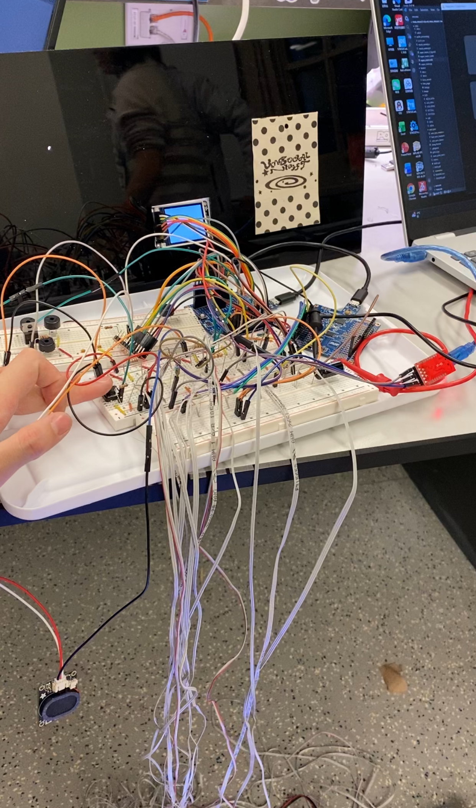

# **dAnciNG**

**Team Number: 9**

| Team Member Name | Email Address           |
| ---------------- | ----------------------- |
| XiANG Ding      | ding1026@seas.upenn.edu |
| YANG Xing       | yangxing@seas.upenn.edu |
| ShANG Wang       | wang0102@seas.upenn.edu |

**GitHub Repository URL: https://github.com/upenn-embedded/final-project-website-submission-f25-t09-f25-machine-not-learning.git**

**GitHub Pages Website URL: https://upenn-embedded.github.io/final-project-website-submission-f25-t09-f25-machine-not-learning/**

<table>
  <tr>
    <td></td>
    <td></td>
    <td></td>
  </tr>
</table>

## 1. Demo

<iframe width="840" height="472"
src="https://www.youtube.com/embed/-tpDP1GK9ac"
frameborder="0"
allow="accelerometer; autoplay; clipboard-write; encrypted-media; gyroscope; picture-in-picture"
allowfullscreen>
</iframe>

**Demo: https://drive.google.com/file/d/1BiyH7qF1WEpQ59m6lbLG-jXoRF1k8Nr0/view?usp=sharing**

**https://youtu.be/-tpDP1GK9ac?si=1uDxwRdN3QnuRwen**

Demo Hint Only: https://drive.google.com/file/d/1PPW-uhF3AvNN9ISKI62phGgpCDDRCXEw/view?usp=sharing

Demo Friday Version: https://drive.google.com/file/d/1Flcp-oRk8asOSFzWwyWyAQS2jyd_Xm3Z/view?usp=sharing

Demo Final Score: https://drive.google.com/file/d/1_QCBmADqtFucWOeTyz4wb9dU2vNdQopz/view?usp=sharing

**In the demo, the device performs the following:**

A team member starts the game and steps on the correct squares of the nine-grid mat in response to the music and prompts. The score appears on the LCD as the game runs.

1. The system plays the Mario melody.
2. For each note:
   * **Timer1 controls the note duration.**
   * **The ADC reads the pressure on the selected block.**
   * **If the user steps on the correct block, the buzzer plays the note.**
   * **The LEDs on the matching strip light up.**
3. The score updates immediately when a correct step is detected.

During gameplay, the mat reads force-sensor data every 50 ± 10 ms. About 0.5 ± 0.1 s before each beat, the LED border around the target block lights up as a hint. If the user steps correctly within ±1 s of the cue, the LEDs turn fully bright, the buzzer plays the tone, and the score on the LCD updates within 1 s.

The LCD shows the score and timing accuracy throughout the song. After the song ends, the system displays the final score within 3 s. All LED and audio outputs stay synchronized under MCU control, demonstrating stable sensing, visual cues, audio feedback, and real-time scoring.

## 2. Abstract

**This project presents a portable music game mat powered by the ATmega328PB microcontroller. The system integrates LEDs, pressure sensors, a buzzer, and an LCD to create an interactive platform where players step in rhythm with preloaded songs. Each correct step triggers full light in light strip and sound feedback, while the LCD displays real-time scores. The design combines entertainment and exercise, offering a fun way to stay active at home.**

A computer plays the song. At the same time, the essential notes from that song were already transformed into real frequencies, then mapped to Timer0 compare values (OCR0B), and saved in the ATmega firmware as fixed arrays. These stored notes are organized by pitch into nine frequency sets, matching nine zones on the carpet. Four LED strips visually mark a 3×3 grid, dividing the mat into nine blocks. As the song progresses, the firmware predicts which block corresponds to the next key note and makes the LED border around that block half-bright just before the note happens. If the player steps on the correct block at the expected moment, the MCU instantly outputs the same note’s frequency as sound and turns that block’s LED border fully bright. If the player does not step correctly, the MCU outputs no sound and the LEDs stay off. This closes the loop: the song runs normally, the firmware forecasts the next key note to preview the block, the footstep decides whether the note is triggered locally in real time, and the LEDs show either a half-bright preview or a full-bright hit result.

## 3. Motivation

In modern life, people often struggle to find enjoyable ways to stay active at home. Traditional home workouts can feel repetitive and uninspiring, while portable fitness or entertainment equipment is usually bulky and inconvenient to use. Activities like yoga or simple floor exercises, though effective, often lack engagement and excitement.

Inspired by the interactive fun of arcade dance machines, we aim to design a lightweight, portable version that brings the same sense of rhythm, movement, and enjoyment into the home environment. Our goal is to make physical activity more accessible and entertaining—something that not only helps people exercise but also lets them have fun while doing it.

This project combines entertainment technology with fitness in a creative and interactive way. It challenges us to rethink how people can engage with exercise through music, rhythm, and motion tracking. By turning a familiar arcade experience into a compact home device, we explore how playful design can promote healthier lifestyles. Moreover, it provides a great opportunity to integrate hardware design, sensor systems, and human–computer interaction, making it both technically and socially meaningful.

## 4. System Block Diagram

## 5. Software Requirements Specification (SRS)

**5.1 Data collection**

**Data collection has been performed through UART logs and ADC sampling traces, showing reliable timing and stable pressure thresholds.**

**5.2 Functionality**

| ID     | Description                                                                                                                                                                                                                                                                                                                              |
| ------ | ---------------------------------------------------------------------------------------------------------------------------------------------------------------------------------------------------------------------------------------------------------------------------------------------------------------------------------------- |
| SRS-01 | The pressure sensors beneath each pad shall be sampled every 50 milliseconds ± 10 milliseconds to detect whether the pad is pressed and to estimate step intensity (light, strong).                                                                                                                                                     |
| SRS-02 | Before each note, a partial section of the corresponding LED strip shall turn on as a visual hint approximately 0.5 ± 0.1 s before the expected step. When the user steps on that block within the valid timing window, the entire LED region for that pad shall light up fully and remain on while the pressure sensor detects contact |
| SRS-03 | The LCD shall refresh the score within 1 second after each step is detected. A score of 1 shall be awarded if the player steps on the correct pad within a ±1 second window from the LED instruction; otherwise, a score of 0 shall be recorded.                                                                                        |
| SRS-04 | After each game session, the system shall display the final score and accuracy summary within 3 seconds of song completion.                                                                                                                                                                                                              |
| SRS-05 | The system shall generate PWM signals at different frequencies to drive the buzzer and produce distinct pitches when the player steps correctly within the allowed 1-second timing window. If no valid step is detected within that window, the buzzer shall not be activated.                                                           |
| SRS-06 | The system shall allow the user to select the difficulty level by pressing a designated button. Each difficulty corresponds to a different preloaded song (e.g., slow or fast tempo). Upon valid button input, the system shall stop the current track and start the selected song within 3 seconds.                                     |

**(a) Real-Time Scheduling (Timer1 Interrupts)**

**Timer1 on ATmega328PB A** operates in CTC mode to generate a 1 ms interrupt. The ISR decreases the remaining duration of a musical note, and asserts sample_flag for periodic ADC sampling.

**(b) Musical**

A single, rhythmically stable instrumental track (.wav) was chosen as the basis for feature extraction. To automate the extraction of dominant pitches from the selected rhythmic audio track, a Python script was developed using librosa. The workflow consists of four main steps. First, the program loads the .wav file and applies the pYIN algorithm to estimate the fundamental frequency (f0) frame-by-frame, using a 20 ms hop size to achieve sufficient temporal resolution. Next, the f0 values are converted into MIDI note numbers, while unvoiced or unreliable frames are marked as None. Because raw frame-level data often produces many short, fragmented notes, the script merges consecutive identical MIDI values into longer note events and discards segments shorter than 40 ms. Finally, the resulting note sequence and corresponding durations are written to an output file for later use. This automated process greatly simplifies pitch extraction and ensures consistent formatting for downstream applications (e.g., PWM tone generation).

The first part of the code converts MIDI note numbers to frequencies using the formula:

**f = 440 × 2^((midi – 69) / 12) ,**

which was verified using known reference pitches. The freq_to_top() function then translates the target frequency into the Timer0 "TOP" value using Fast PWM with OCR0A as the register.

**TOP = F_CPU / (2 * prescaler * freq) − 1.**

The play_midi() function was tested by manually sweeping through known MIDI notes (e.g., 60, 69, 72) and confirming correct tone reproduction. A safety condition was added to mute invalid or zero-frequency notes by forcing OCR0A = 0.

The notes[] and durations[] arrays generated from Python were then integrated into a simple playback loop.

Overall, the development process involved a combination of audio preprocessing challenges, Python-based feature extraction, microcontroller timer configuration, and waveform debugging using an oscilloscope and test tones. The final system successfully plays back the extracted melody using hardware PWM on the ATmega328PB.

A melody (173 MIDI notes) is played using:

* **MIDI → frequency mapping** via an exponential function
* Runtime conversion of **frequency to Timer0 TOP value**
* PWM generation on **OC0B** at 50% duty cycle

**Runtime conversion of MIDI note to frequency (not storing precomputed frequencies) because the MIDI array is smaller than a frequency table, thus reducing SRAM usage. Frequencies are computed in real time instead of being hard-coded.**

The part supports real-time pitch triggering via pressure input.

**(c) Pressure Input**

Signal chain : **5 V → 1 MΩ resistor → ADC input → Force-Sensitive Resistor 5 MΩ → ground**.

The pressure sensor is a force-sensitive resistor (5 MΩ when not pressed). Pressure lowers its resistance, decreasing its voltage.

The GPIO + MUX selects one sensor according to **the active note’s  block index**.

After **channel switching**, firmware inserts a short delay to ensure the MUX output and divider voltage are stable before ADC sampling.

ADC conversion is called by **software**.

The MCU compares the ADC reading to a **threshold** to detect a foot press and checks if the pressed sensor matches the active block.

A correct step adds +10 to score.

**(d) SK6812 LED Strip Driver**

The LED controller toggles GPIO pins (ATmega328PB B PORTC, PC0, PC1, PC2, PC3) using bit-level register manipulation macros that compile into single AVR instructions , achieving near one-clock-cycle execution time for deterministic GPIO switching.

LED bit timing is produced by **__builtin_avr_delay_cycles**() to match **SK6812 protocol** requirements under a 16 MHz clock.

A RGBW pixel frame is 32 bits per LED, transmitted serially for all LEDs in a selected strip segment.

**To prevent hardware resource contention, LED driving is fully isolated on a dedicated UART-controlled sub-ATmega328PB. The hostATmega328PB sends LED update commands via UART, while retaining control of ADC channel selection, speaker PWM, and LCD SPI, ensuring stable timing for the MVP demo.**

Block-to-strip mapping is generated by note_to_block() and led_set_block(), enabling LED visualization.

Implemented driver interface:

* `init_strips()` – configure data GPIOs.
* `clear_all_strips()` – clear all strips.
* `led_show_block(uint8_t block)` – solid color render for block `b`.
* `led_show_block_hint(uint8_t block)` – patterned/half-on hint render for block `b`.

**(e) LCD Graphics Library**

The ST7735 display uses a custom library supporting:

* Pixel, line, block, and circle drawing
* RGB565 conversion
* String rendering using an ASCII LUT
* Full-screen color fills
* Game UI functions (score updates)

**(f) UART**

The system is implemented across **two microcontroller boards** built on the same hardware platform Microchip with the MCU model ATmega328PB.

* **Board A (Main controller)** runs the **application state machine** that determines lighting modes (block vs hint display), generates command frames.
* **Board B (LED controller)** runs a **minimal loop-driven receiver** for lighting commands and controls LED strips.

A core application loop:

1. Decode incoming sensor or host command.
2. Decide LED mode.
3. Pack mode into a single byte frame.
4. Transmit frame via **UART1 to Board B**.

The lighting logic operates deterministically at **1 Hz block update**, alternating between led_show_block() and led_show_block_hint() based on mode.

## 6. Hardware Requirements Specification (HRS)

**6.1 Data collection**

**Data collection includes logic analyzer and oscilloscope traces of the LED timing protocol and ADC conversion timing measurements.**

**6.2 Functionality**

| ID     | Description                                                                                                                                                              |
| ------ | ------------------------------------------------------------------------------------------------------------------------------------------------------------------------ |
| HRS-01 | The ATmega328PB microcontroller shall operate to ensure accurate timing control for LED and sound synchronization using pressure sensors and SPI communication with LCD. |
| HRS-02 | Each pressure sensor beneath the mat modules shall detect applied forces in the range of0 N to 686 N (0-37kPa) with a voltage output sensitivity of ≥10 mV/N.          |
| HRS-03 | Each LED module shall respond to control signals with a latency of less than 50 ms and be capable of displaying 9 different colors representing different musical tones. |
| HRS-04 | The integrated speaker shall reproduce musical notes within the 200 Hz–5 kHz frequency range with a minimum output level of 90 dB measured at 0.5 m distance.           |
| HRS-05 | The LCD display shall update player scores with a refresh delay of no greater than 200 ms after each scoring event.                                                      |
| HRS-06 | The button is used to switch songs for different difficult levels.                                                                                                       |

1. **Pressure Sensing**

   A **74HC4051 analog multiplexer** selects among multiple pressure sensors.

   Three MCU pins (PD[3:2], PB4) drive the MUX address lines, and the selected signal is read through **ADC7** (PE3).
2. **Audio Output**

   A speaker is driven by **ATmega328PB A Timer0 PWM**.

   MIDI notes are converted to frequencies, and the timer’s TOP value generates the corresponding tone.
3. **LED Visualization**

   Four **SK6812 LED strips** (60 LEDs each) are controlled using cycle-accurate RGBW timing.

   Each strip uses a dedicated MCU **GPIO** pin (PC0, PC1, PC2, PC3 on **ATmega328PB B**), enabling independent block lighting.
4. **LCD Display**

   A **1.8'' ST7735 TFT** display is connected via SPI.

   It shows text and simple graphics for system feedback (current score).
5. **Power**

   All components operate from a **5 V / 3.3 V supply** .

   LED strips share ground with the MCU and receive a separate 5 V rail due to higher current demand.

## 7. Results and Conclusion

Our final solution addressed the problem that commercial dance-arcade machines are expensive, bulky, and not accessible for casual use. We designed and built a portable, low-cost dance pad that replicates the core gameplay experience and integrates seamlessly with a computer.

Once the pad is connected to a PC, pressing a start button initializes the game. During gameplay, blocks are displayed on the screen, where each block can appear as a hint (shown in yellow) or detected as a correct step (shown in green) when the user steps on the corresponding pad region. At the same time, an onboard LCD keeps a real-time score, incrementing by one point for every correct step.

The dance pad itself uses four LED strips arranged to represent nine grid cells. Visual feedback is provided directly on the pad:

* Hints are illuminated using intermittent white light
* Successful steps trigger solid red light

To enhance immersion, background music (BGM) plays through the computer once the game begins. Additionally, each successful step activates a buzzer on the dance pad that produces a corresponding tone in sync with the music.

Overall, our final design provides an engaging, responsive, and affordable alternative to arcade dance-machine systems, while maintaining portability and interactive feedback through LEDs, audio cues, and real-time scoring.

#### 7.1 Software Requirements Specification (SRS) Results

| ID     | Description                                                                                                                                                                                                                                                                                                                              | Validation Outcome                                                                                                                  |
| ------ | ---------------------------------------------------------------------------------------------------------------------------------------------------------------------------------------------------------------------------------------------------------------------------------------------------------------------------------------- | ----------------------------------------------------------------------------------------------------------------------------------- |
| SRS-01 | The pressure sensors beneath each pad shall be sampled every 50 milliseconds ± 10 milliseconds to detect whether the pad is pressed and to estimate step intensity (light, strong).                                                                                                                                                     | Confirmed, ISR of 5ms is implemented.                                                                                               |
| SRS-02 | Before each note, a partial section of the corresponding LED strip shall turn on as a visual hint approximately 0.5 ± 0.1 s before the expected step. When the user steps on that block within the valid timing window, the entire LED region for that pad shall light up fully and remain on while the pressure sensor detects contact | Confirmed, block lighting has same pace as ui and bgm.                                                                              |
| SRS-03 | The LCD shall refresh the score within 1 second after each step is detected. A score of 1 shall be awarded if the player steps on the correct pad within a ±1 second window from the LED instruction; otherwise, a score of 0 shall be recorded.                                                                                        | Confirmed, presssing a sensor will give immdediate feedback that human eyes cannot detect delay.                                    |
| SRS-04 | After each game session, the system shall display the final score and accuracy summary within 3 seconds of song completion.                                                                                                                                                                                                              | Confirmed, immediate scoring that humen eyes cannot detect delay.                                                                   |
| SRS-05 | The system shall generate PWM signals at different frequencies to drive the buzzer and produce distinct pitches when the player steps correctly within the allowed 1-second timing window. If no valid step is detected within that window, the buzzer shall not be activated.                                                           | Confirmed, correct step will generate a tone in response to bgm and incorrect step will not generate anything.                      |
| SRS-06 | The system shall allow the user to select the difficulty level by pressing a designated button. Each difficulty corresponds to a different preloaded song (e.g., slow or fast tempo). Upon valid button input, the system shall stop the current track and start the selected song within 3 seconds.                                     | Modified, finding another suitable continuous song was too time-consuming, so a start/reset button was used instead to ensure sync. |

#### 7.2 Hardware Requirements Specification (HRS) Results

| ID     | Description                                                                                                                                                              | Validation Outcome                                                                                                                                                                                                                                                                                                                                                  |
| ------ | ------------------------------------------------------------------------------------------------------------------------------------------------------------------------ | ------------------------------------------------------------------------------------------------------------------------------------------------------------------------------------------------------------------------------------------------------------------------------------------------------------------------------------------------------------------- |
| HRS-01 | The ATmega328PB microcontroller shall operate to ensure accurate timing control for LED and sound synchronization using pressure sensors and SPI communication with LCD. | Confirmed, the demo video shows when the button of the game is pressed, the MCU controls the collaboration of LED, LCD, pressure sensors and speakers accurately. When the certain music tone comes, the LED first turns white for hint; If the pressure sensor is stamped, the LED turns red and the speaker plays the correct tone, the score on the LCD changes. |
| HRS-02 | Each pressure sensor beneath the mat modules shall detect applied forces in the range of0 N to 686 N (0-37kPa) with a voltage output sensitivity of ≥10 mV/N.          | Confirmed, the nine pressure sensors are connected to resistors separately. When the ADC detects voltage of the sensor below the threshold value 850/1024, the block was determined as stamped on. The demo video shows when the block is stamped on, the color of LED turns from white to red.                                                                     |
| HRS-03 | Each LED module shall respond to control signals with a latency of less than 50 ms and be capable of displaying 9 different colors representing different musical tones. | Confirmed, the demo video shows when the sensor detects the force, the led turns from white to red; And when the certain music tone comes, the LED on the block corresponding to the tone shines white for hint.                                                                                                                                                    |
| HRS-04 | The integrated speaker shall reproduce musical notes within the 200 Hz–5 kHz frequency range with a minimum output level of 90 dB measured at 0.5 m distance.           | Confirmed, the demo video shows the speaker plays the correct music tone at the correct with a big volume with the background music generated by the computer.                                                                                                                                                                                                      |
| HRS-05 | The LCD display shall update player scores with a refresh delay of no greater than 200 ms after each scoring event.                                                      | Confirmed, the demo video shows when the button is pressed, the score on LED is reset. During the game, the score accumulates and shows the final score at the end of the game.                                                                                                                                                                                     |
| HRS-06 | The button is used to switch songs for different difficult levels.                                                                                                       | Confirmed, the demo video shows when the button is pressed, the score on LED is reset and the program is running for the game.                                                                                                                                                                                                                                      |

* **What did you learn from it?**
* Fundamental and applied use of PWM, ADC, SPI, UART, addressable LEDs, audio‐frequency generation, and methods for integrating subsystems under strict timing constraints.
* **What went well?**
* The MUX and SPI subsystems worked smoothly.
* **What accomplishments are you proud of?**
* System-level synchronization. The PC and MCU (speaker/buzzer, LEDs) now run in full lockstep. When stepped, the buzzer pitch aligns exactly with the music.
* **What did you learn/gain from this experience?**
* Before using any device, specifications must be checked carefully in slides and datasheets. If unclear, additional research is required. About 60% of bugs came from oversight and 40% from unknown constraints, and systematic debugging tools such as printf and debug mode are essential.
* **Did you have to change your approach?**
* Yes. The initial plan used a single board, but timing-conflict issues made a two-board architecture necessary despite having already purchased a MUX.
* **What could have been done differently?**
* Speaker input. The current direct PWM square-wave drive (PD5) is inconsistent. A DAC plus amplifier would produce more stable and higher-quality audio.
* **Did you encounter obstacles that you didn’t anticipate?**
* Incorrect PWM formulas causing pitch errors. Insufficient RAM. Unstable ADC readings leading to deadlock. SPI refresh delays affecting note durations. UART transmission overruns. Incorrect LED timing pulses. Timer interrupts disturbing LED timing. A wrong data type for the global variable `remaining_ms` causing deadlock.
* **What could be a next step for this project?**
* Improve wiring, increase FSR measurement stability, and expand the music library.

